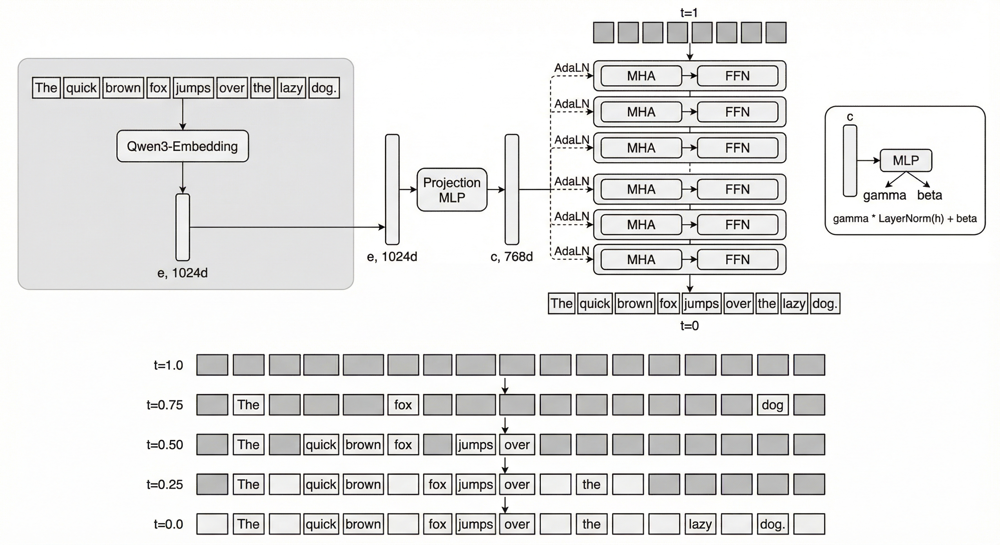
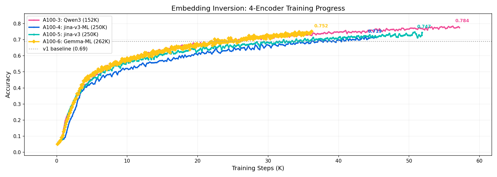
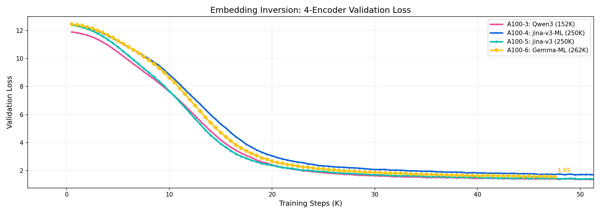

# Embedding Inversion via Conditional Masked Diffusion

[Technical Report](technical-report.pdf) | [Live Demo](https://embedding-inversion-demo.jina.ai)

Text embeddings are widely assumed to be safe, irreversible representations. This project demonstrates otherwise: given only an embedding vector, we reconstruct the original text using conditional masked diffusion.



## How It Works

Existing inversion methods (Vec2Text, ALGEN, Zero2Text) generate tokens autoregressively and require iterative re-embedding through the target encoder. This creates two bottlenecks: attack cost scales with correction iterations, and left-to-right generation accumulates errors with no mechanism to revise earlier tokens.

We take a different approach: **embedding inversion as conditional masked diffusion**. Starting from a fully masked sequence, a denoising model reveals tokens at all positions in parallel, conditioned on the target embedding via adaptive layer normalization (AdaLN-Zero). Each denoising step refines all positions simultaneously using global context, without ever re-embedding the current hypothesis.

The approach is encoder-agnostic by construction. The embedding vector enters only through AdaLN modulation of layer normalization parameters, so the same architecture applies to any embedding model without alignment training or architecture-specific modifications.

Check out the [live demo](https://embedding-inversion-demo.jina.ai) to see it in action.

## Data Preparation

Two-stage pipeline: download raw texts, then tokenize and encode with the target embedding model.

```bash
# Stage 1: download multilingual raw texts (run once, reusable across encoders)
python prepare_data_fast.py --stage 1 \
  --langs en,zh,de,fr,ja,es,ru,ko,ar,pt \
  --n-samples 5000000

# Stage 2: tokenize + encode for a specific encoder (run per encoder)
python prepare_data_fast.py --stage 2 \
  --config configs/v2_qwen3.yaml \
  --encode-batch 512
```

Stage 1 downloads from C4/mC4 and saves raw texts as JSON chunks. Stage 2 reads those texts, tokenizes with the encoder's tokenizer (truncated to `seq_len` tokens), encodes into embeddings, and saves as numpy arrays.

Supported encoders via config:

| Config | Encoder | Embedding Dim | Vocab |
|--------|---------|--------------|-------|
| v2_qwen3.yaml | Qwen/Qwen3-Embedding-0.6B | 1024 | 152K |
| v2_jinav3.yaml | jinaai/jina-embeddings-v3 | 1024 | 250K |
| v2_gemma.yaml | unsloth/embeddinggemma-300m | 768 | 262K |

## Training

```bash
# Train with a specific config
python train.py --config configs/v2_qwen3.yaml

# Resume from checkpoint
python train.py --config configs/v2_qwen3.yaml --resume
```




Four encoders trained in parallel on A100-40GB GPUs. Qwen3-Embedding leads with 81.3% token accuracy at 72.5K steps. All models use the same 78M-parameter MDLM backbone with AdaLN-Zero conditioning.

| Encoder | Vocab | Acc | Steps | Batch | Data |
|---------|-------|-----|-------|-------|------|
| Qwen3-Embedding-0.6B | 152K | 81.3% | 72.5K | 900 | 2M multilingual |
| jina-embeddings-v3 | 250K | 77.3% | 67K | 600 | 2M en |
| EmbeddingGemma-300m | 262K | 78.5% | 47.5K | 500 | 2M multilingual |
| jina-embeddings-v3 (ML) | 250K | 75.2% | 60K | 600 | 2M multilingual |

Key training parameters (in config yaml):
- `batch_size`: per-GPU batch size (auto-detected if not set)
- `grad_accum`: gradient accumulation steps
- `max_steps`: total training steps
- `lr`: peak learning rate (cosine schedule with warmup)
- `eval_every`: validation frequency

The model uses mixed precision (bf16) and EMA weight averaging. Checkpoints are saved to `checkpoints/` with `best.pt` tracking the lowest validation loss.

Training logs report step, loss, accuracy, and learning rate. Accuracy measures exact token match at masked positions.

## Inference

### Interactive Demo

```bash
pip install fastapi uvicorn
python demo_server.py
```

Opens on port 8080. Live demo: https://embedding-inversion-demo.jina.ai

### Programmatic Inversion

```bash
python invert.py \
  --config configs/v2_qwen3.yaml \
  --checkpoint checkpoints/qwen3_best.pt \
  --text "The quick brown fox jumps over the lazy dog"
```

This encodes the input text, then runs diffusion decoding to reconstruct it from the embedding alone. Supports multiple decoding strategies (greedy, Euler sampling, adaptive re-masking).

## Files

| File | Description |
|------|-------------|
| train.py | Training loop with cosine LR, EMA, mixed precision |
| dataset.py | PyTorch dataset for token_ids + embeddings |
| model.py | Conditional MDLM with AdaLN-Zero conditioning |
| prepare_data_fast.py | Two-stage data preparation (download + encode) |
| invert.py | Diffusion sampling and decoding strategies |
| demo_server.py | FastAPI server for interactive demo |
| index.html | Demo frontend |
| configs/ | Encoder-specific training configurations |

## Citation

```bibtex
@techreport{xiao2025embeddinginversion,
  author       = {Xiao, Han},
  title        = {Embedding Inversion via Conditional Masked Diffusion Language Models},
  institution  = {Jina AI by Elastic},
  year         = {2025},
  url          = {https://github.com/hanxiao/embedding-inversion-demo},
  note         = {Live demo: https://embedding-inversion-demo.jina.ai}
}
```
